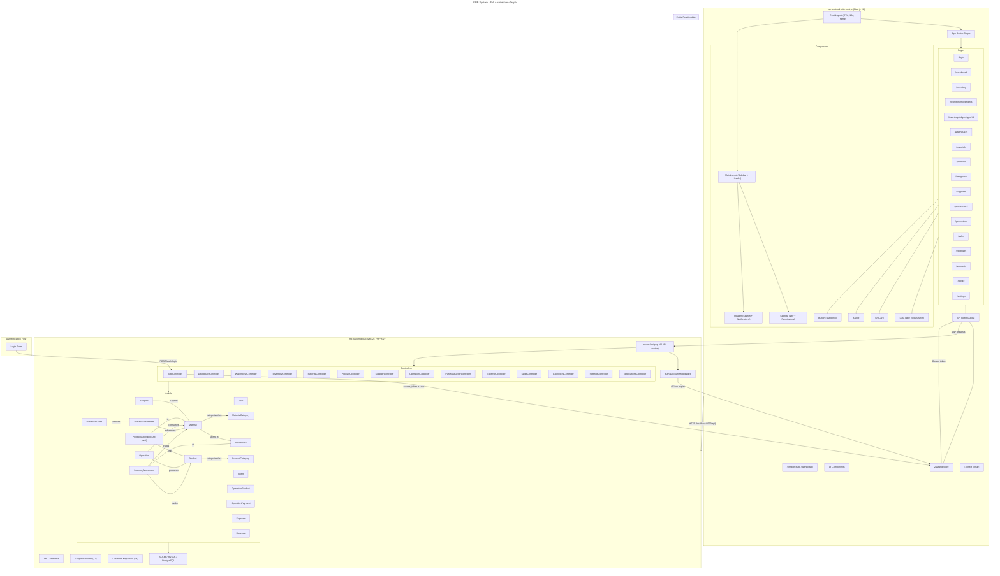
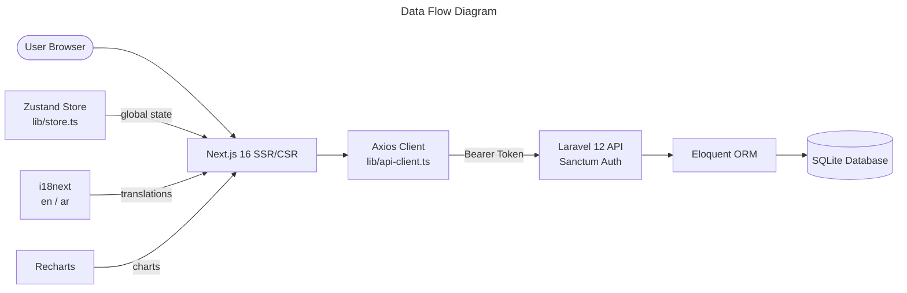
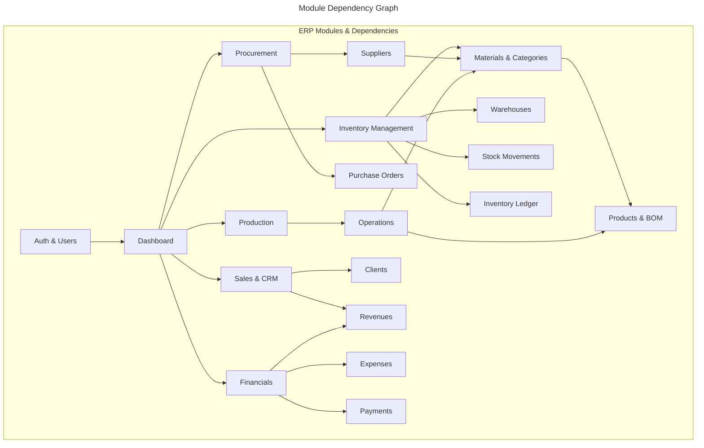
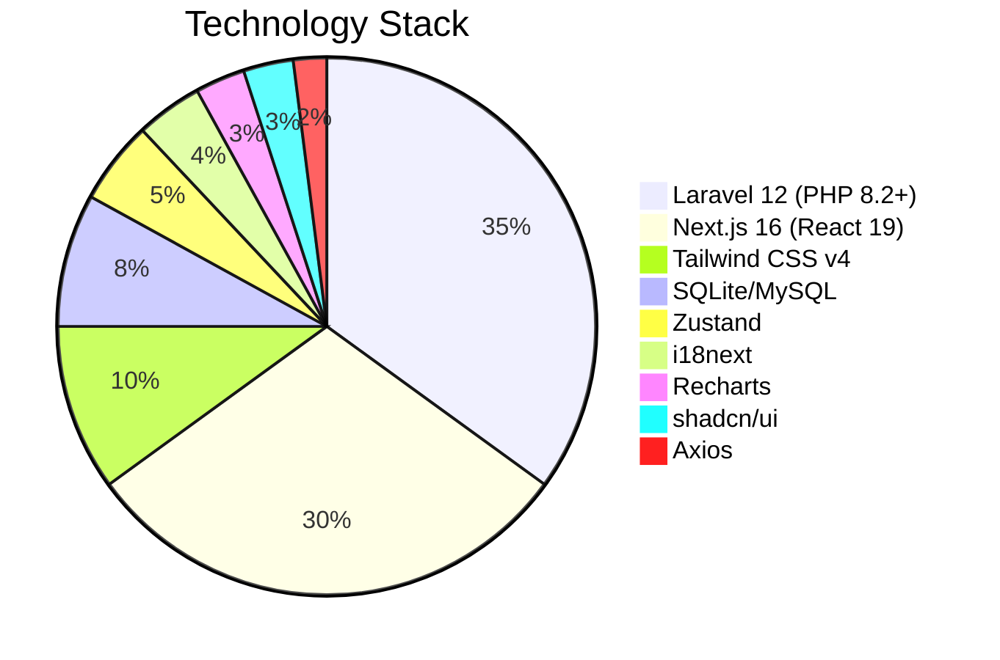
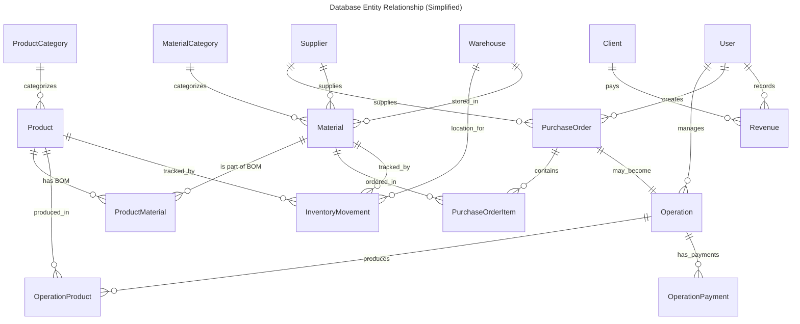

# ERP System Architecture









```mermaid
---
title: Route Map - Frontend Pages
---
mindmap
  root((ERP System))
    ::id1
    Auth
      /login
    Dashboard
      /dashboard
    Inventory
      /inventory
      /inventory/movements
      /inventory/ledger/[type]/[id]
    Master Data
      /warehouses
      /materials
      /products
      /categories
      /suppliers
    Operations
      /procurement
      /production
    Sales & CRM
      /sales
      /accounts
    Finance
      /expenses
    System
      /profile
      /settings
```



> Generated by `/graphify` — full architecture overview of the ERP system
